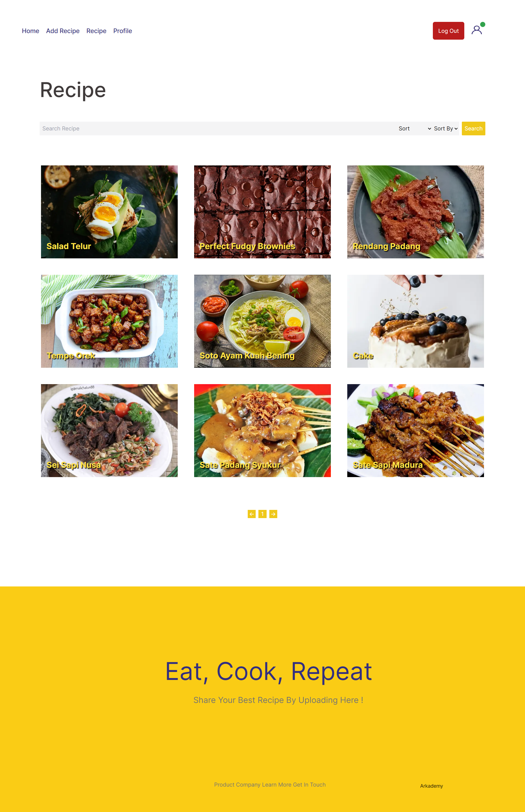

# Mama Recipe

Food Recipe find your favorite recipes here and also share your own recipes by uploading recipes.

## Tech Stack

**Programming language:** JavaScript

**Library:** React.Js

**Framework:** TailwindCSS, Next.Js, Express.Js

**Server Side:** Node.Js

[](https://skillicons.dev)

## Features

🔥Upload Recipe

🔥Edit Recipe

🔥Browse Recipe

🔥Detail Recipe

🔥Delete Recipe

🔥Liked and Saved Recipe

🔥Update Profile

## Installation

#### Clone this repository

```bash
   git clone https://github.com/SwitchZer/food-recipe.git
```

#### Install Depedencies

```bash
   npm install
```

#### Start Project

```bash
   npm run dev
```

## Environment Variables

To run this project, you will need to add the following environment variables to your .env file

`NEXT_PUBLIC_API_BASE_URL`

## Screenshots

<table>
   <tr>
      <td>Landing Page</td>
      <td>Detail Recipe</td>
   </tr>
   <tr>
      <td></td>
      <td></td>
   </tr>
   <tr>
      <td>Login Page</td>
      <td>Register Recipe</td>
   </tr>
   <tr>
      <td></td>
      <td></td>
   </tr>
   <tr>
      <td>Add Recipe</td>
      <td>Search Recipe</td>
   </tr>
   <tr>
      <td></td>
      <td></td>
   </tr>
   <tr>
      <td>Profile</td>
      <td>Saved Recipe</td>
   </tr>
   <tr>
      <td></td>
      <td></td>
   </tr>
   <tr>
      <td>Liked Recipe</td>
      <td>Update Recipe</td>
   </tr>
   <tr>
      <td></td>
      <td></td>
   </tr>
</table>

## License

This project is licensed under the MIT License - see the [LICENSE](LICENSE) file for details.

## Contact

Feel Free to Contact me using [alfredcnzagoto@gmail.com](alfredcnzagoto@gmail.com).

## Contributing

Contributions are always welcome!

## Related Project

Project Related to this Project.

[Food Recipe Backend](https://github.com/SwitchZer/hire-job-backend)
